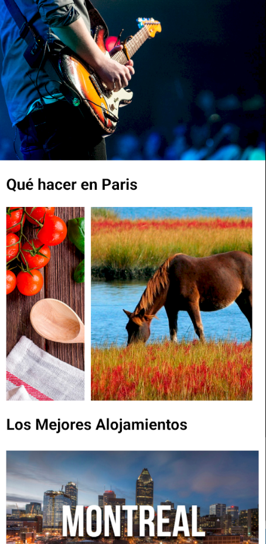
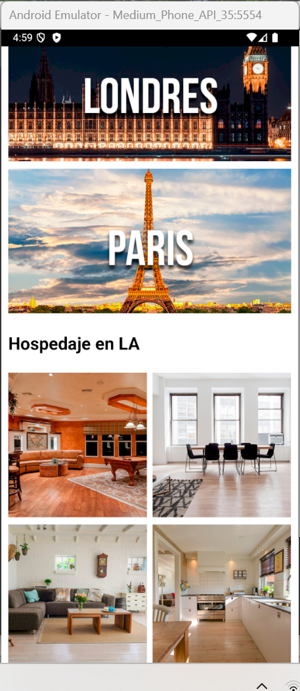

Esta es una pequeña practica para la distribución de los elementos en una app, mediante flex en react-native.

Contiene tanto scroll vertical parte principal, y scroll horizontal para la parte de Paris

Varias capturas del simulador

